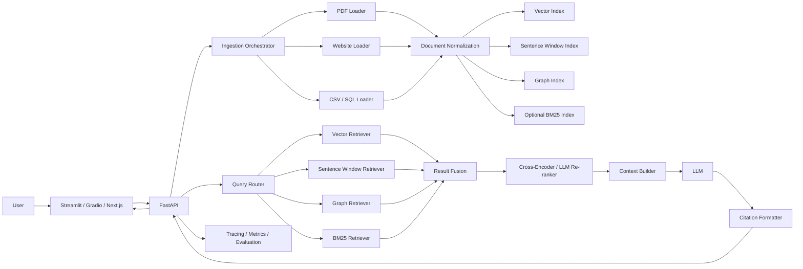

# Advanced Multi-Source Enterprise RAG — Architecture

## 1. Architectural Style
Use a modular, layered architecture with clear separation between:

- Ingestion
- Parsing and normalization
- Indexing
- Retrieval
- Fusion
- Re-ranking
- Context assembly
- Generation
- Citations
- Evaluation and observability
- Presentation/UI

The design should allow each retriever and storage backend to be replaced independently.

## 2. High-Level Architecture



## 3. Main Components

### 3.1 Presentation Layer
Initial implementation:
- Streamlit

Optional production deployments:
- Next.js frontend + FastAPI backend hosted together on Vercel
- Next.js frontend hosted on Vercel + FastAPI backend hosted on Azure
- Streamlit/Gradio frontend + FastAPI backend hosted on Azure

Responsibilities:
- Source upload and configuration
- Ingestion status
- Chat interface
- Source citations
- Retrieval debug panel
- Admin settings

### 3.2 API Layer
FastAPI exposes:

- `POST /sources/pdf`
- `POST /sources/web`
- `POST /sources/csv`
- `POST /sources/database`
- `POST /sources/{source_id}/index`
- `GET /sources`
- `DELETE /sources/{source_id}`
- `POST /query`
- `GET /query/{trace_id}`
- `GET /health`

### 3.3 Ingestion Layer
Defines a common `SourceConnector` contract.

```python
class SourceConnector(Protocol):
    async def load(self, source_config: SourceConfig) -> list[RawDocument]: ...
```

Implementations:
- `PdfConnector`
- `WebsiteConnector`
- `CsvConnector`
- `SqlConnector`

### 3.4 Normalized Document Model
All sources map into a common schema.

```text
NormalizedDocument
- document_id
- tenant_id
- source_id
- source_type
- title
- content
- source_uri
- page_number
- row_id
- table_name
- section
- created_at
- metadata
```

### 3.5 Indexing Layer
Creates multiple index representations from the same normalized corpus.

#### Vector Index
Stores embedding vectors and metadata.

Development:
- FAISS

Production:
- Pinecone or other managed vector store

#### Sentence Window Index
Stores individual sentences as retrieval units plus a metadata field containing neighboring sentences.

Example:
- sentence = retrieval target
- window = previous 2 + current + next 2 sentences

At retrieval time, replace the narrow sentence with its wider window before LLM context construction.

#### Graph Index
Represents entities and relationships such as:

```text
Employee -> WORKS_FOR -> Department
Policy -> APPLIES_TO -> Department
Product -> OWNED_BY -> BusinessUnit
Contract -> REFERENCES -> Regulation
```

Recommended approaches:
- LlamaIndex `PropertyGraphIndex`
- Neo4j for production graph persistence
- LLM-assisted entity and relation extraction

#### Lexical Index
Optional BM25 retrieval for exact identifiers, acronyms, policy numbers, product names, and terminology.

## 4. Query-Time Architecture

### 4.1 Query Normalization
Normalize:
- punctuation
- spelling where safe
- aliases
- date formats
- known enterprise acronyms

Do not rewrite in a way that changes user intent.

### 4.2 Query Router
Determine retrieval strategy.

Examples:
- “What does policy HR-402 say?” → BM25 + vector
- “Who owns Project Atlas?” → graph + vector
- “Explain the paragraph around termination notice” → sentence window + vector
- “Compare revenue by region” → structured SQL/CSV retriever + vector metadata if needed

Initial implementation may activate all retrievers and optimize routing later.

### 4.3 Common Evidence Object
All retrievers return:

```text
Evidence
- evidence_id
- retriever
- content
- raw_score
- normalized_score
- source_id
- source_type
- source_uri
- page_number
- row_id
- table_name
- entity_ids
- metadata
```

## 5. Fusion Strategy

### Recommended MVP
Reciprocal Rank Fusion (RRF):

```text
RRF(d) = Σ 1 / (k + rank_i(d))
```

Benefits:
- Works even when retrievers have incomparable scoring scales
- Easy to reason about
- Robust baseline

### Advanced Weighted Fusion
Example:

```text
final_fusion_score =
  0.40 * vector_score +
  0.25 * sentence_window_score +
  0.25 * graph_score +
  0.10 * lexical_score
```

Weights should eventually be learned or tuned with an evaluation set.

## 6. Re-ranking Architecture

### Preferred
Cross-encoder re-ranker from Hugging Face.

Candidate models may include:
- BAAI/bge-reranker family
- cross-encoder/ms-marco family

Flow:
1. Fuse top 30-50 candidates.
2. Re-rank against the user query.
3. Keep top 6-12 evidence items.
4. Enforce source diversity.

## 7. Context Builder
Responsibilities:

- Remove duplicates
- Merge overlapping chunks
- Preserve citation IDs
- Enforce context token budget
- Prefer evidence diversity across source types
- Optionally include structured result summaries

## 8. LLM Prompting Architecture

### System Rules
The LLM must:
- Answer only from provided evidence.
- Cite claims.
- State when the evidence does not contain the answer.
- Avoid inventing policies, numbers, people, or records.
- Distinguish direct evidence from inference.

### Output Contract

```json
{
  "answer": "...",
  "citations": [
    {
      "citation_id": "S1",
      "source_id": "...",
      "locator": "page 4"
    }
  ],
  "confidence": 0.86
}
```

## 9. Structured Data Retrieval
Use two modes.

### Row-as-Document Mode
Convert each CSV/database row into a text representation and embed it.

Good for:
- FAQs
- product catalogs
- employee directories
- small structured datasets

### SQL Tool Mode
Use schema-aware natural-language-to-SQL for aggregation and filtering.

Good for:
- “What was total revenue in Q2?”
- “Which region had the highest churn?”
- “List open tickets older than 30 days.”

SQL generation must be read-only and restricted to approved schemas.

## 10. Data Storage

### Required Stores
- Object storage: original files
- Vector store: semantic index
- Graph store: entity/relation index
- Relational DB: source registry, traces, users, metadata

### Recommended Production Mapping
- Azure Blob Storage → original PDFs and CSVs
- PostgreSQL → metadata/configuration/traces
- Pinecone → vector index
- Neo4j → knowledge graph

## 11. Deployment Topologies

### Option A — Simplest
- Streamlit application
- FAISS
- local SQLite/PostgreSQL
- Hugging Face embeddings
- external LLM API

### Option B — Azure Production
- Azure Container Apps: FastAPI + workers
- Azure Blob Storage
- Azure PostgreSQL
- Azure Key Vault
- Pinecone / supported vector store
- Neo4j Aura or managed Neo4j
- Streamlit app deployed as a container or separate frontend

### Option C — Vercel Full-Stack: Next.js + FastAPI
Use Vercel for both the web frontend and the FastAPI API when the application is primarily request/response driven and expensive stateful infrastructure is externalized.

Recommended layout:

```text
/
├── app/                     # Next.js frontend
├── components/              # React UI components
├── api/
│   └── index.py             # FastAPI entry point for /api/*
├── src/
│   └── rag/                 # Python RAG modules imported by FastAPI
├── pyproject.toml           # Python dependencies
├── package.json             # Next.js dependencies
└── vercel.json              # Optional overrides only when needed
```

Request path:

```text
Browser
  -> Vercel / Next.js
      -> /api/query
          -> FastAPI on Vercel Python runtime
              -> Pinecone / managed vector DB
              -> Neo4j Aura / managed graph DB
              -> PostgreSQL / managed SQL
              -> Blob/Object Storage
              -> Embedding + re-ranking + LLM APIs
```

Responsibilities on Vercel FastAPI:
- Authentication and tenant validation
- Source registration
- Query routing
- Vector, graph, lexical, and structured retrieval orchestration
- Reciprocal Rank Fusion
- Re-ranking
- Context assembly
- LLM calls
- Citation formatting
- Query tracing and feedback APIs

Keep state outside the Vercel function:
- Pinecone or another managed vector DB for embeddings
- Neo4j Aura for the knowledge graph
- Neon, Supabase, Azure PostgreSQL, or another managed PostgreSQL service for metadata
- Azure Blob Storage, Vercel Blob, S3-compatible storage, or another object store for source files
- External model APIs or lightweight hosted inference for generation, embeddings, and re-ranking

Example FastAPI entry point:

```python
# api/index.py
from fastapi import FastAPI

app = FastAPI(title="Enterprise Multi-Source RAG API")


@app.get("/api/health")
def health() -> dict[str, str]:
    return {"status": "ok"}


@app.post("/api/query")
async def query(request: QueryRequest) -> QueryResponse:
    return await rag_service.answer(request)
```

Vercel packages `api/index.py` as a Python function and can serve the Next.js frontend and FastAPI routes from the same project/domain. This reduces deployment complexity and normally avoids cross-origin configuration between the web UI and API.

#### Vercel RAG Design Rules
Do not treat the FastAPI deployment as the place for durable local state. Avoid relying on a local FAISS file, local Neo4j instance, local uploaded-file directory, or in-memory job queue in production.

For ingestion:

```text
POST /api/sources
   -> validate/upload source
   -> persist original source externally
   -> create ingestion job
   -> background worker/service parses + chunks + embeds + builds graph
   -> managed indexes are updated
   -> source status becomes READY
```

Short ingestion operations can execute through the API, but large PDF parsing, website crawling, bulk embedding, graph construction, and large CSV/database synchronization should be delegated to a durable worker. Suitable worker choices include Azure Container Apps Jobs, Azure Functions, a queue-backed Python worker, or a dedicated container/service.

Therefore, a strong Vercel production pattern is:

```text
Vercel
├── Next.js UI
└── FastAPI query/control plane

Managed data layer
├── Pinecone
├── Neo4j Aura
├── PostgreSQL
└── Object Storage

Worker layer
└── Azure Container Apps Jobs / other durable Python worker
```

This gives the project a genuine FastAPI-on-Vercel deployment option while keeping computationally heavy or long-running ingestion outside the request path.

### Option D — Vercel + Azure Split
- Vercel: Next.js frontend
- Azure: FastAPI RAG backend and ingestion workers
- Managed Pinecone / Neo4j / PostgreSQL
- Azure Blob Storage for uploaded source documents

Choose this topology when:
- ingestion and indexing workloads are consistently heavy
- the API requires long-running Python processes
- private networking to Azure resources is important
- enterprise deployment controls favor Azure-hosted backend services
- you want the frontend deployment lifecycle separated from the RAG backend

### Deployment Recommendation by Stage

| Stage | Recommended topology |
|---|---|
| Learning / local prototype | Streamlit + FastAPI + FAISS |
| Portfolio demo | Next.js + FastAPI on Vercel + managed vector/graph stores |
| Moderate production workload | Vercel FastAPI query API + external ingestion worker |
| Heavy enterprise ingestion | Vercel frontend + Azure FastAPI/workers |
| Azure-first enterprise environment | Full Azure backend + optional Vercel frontend |

## 12. Security Architecture
- JWT/OIDC authentication
- Tenant ID attached to every source and index entry
- Metadata filter enforced for every retrieval
- Read-only database credentials for structured retrieval
- PII-aware logs
- No raw secrets stored in prompt traces
- File scanning hook before ingestion
- Allowed-domain rules for website crawling

## 13. Observability
Capture per query:
- Query text
- Retriever activation
- Candidate counts
- Retrieval scores
- Fusion scores
- Re-ranking scores
- Final context sources
- LLM model
- Token counts
- Latency
- Answer
- User feedback

## 14. Evaluation
Recommended metrics:
- Recall@K
- Precision@K
- MRR
- NDCG
- Faithfulness
- Answer relevance
- Context relevance
- Citation accuracy
- Groundedness
- Latency
- Cost/query
